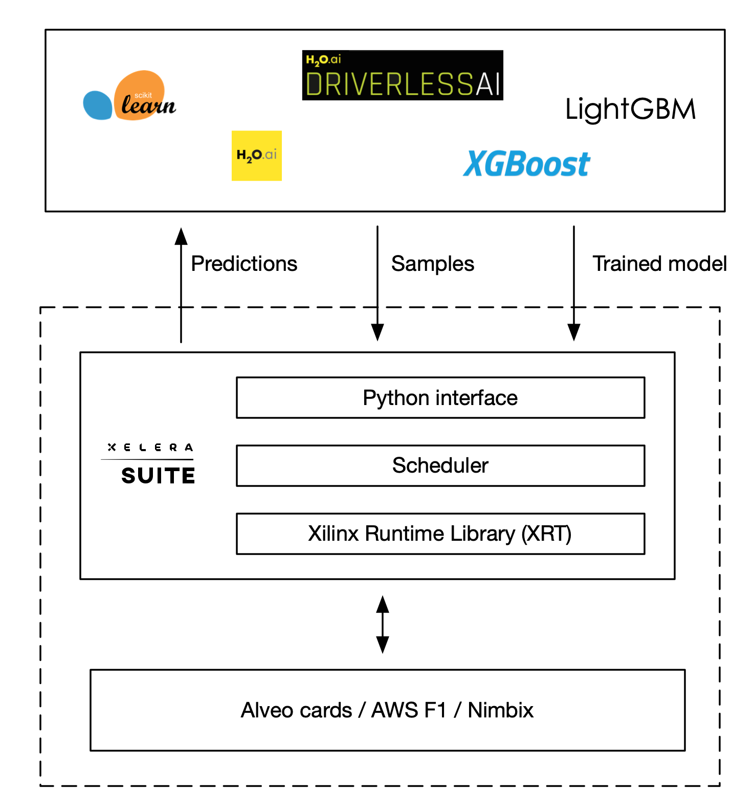

# Xelera decision Tree Inference

**Xelera decision Tree Inference** provides FPGA-accelerated inference (prediction) for real-time Classification and Regression applications when high-throughput or low-latency matters. It supports **Random Forest**, **XGBoost** and **LightGBM** algorithms. The user should first train its own model using one of the supported frameworks (**Scikit-learn**, **XGBoost**, **LightGBM**, **H20.ai** and **H20 Driverless AI**) and then load and run the prediction via a Python call to Xelera decision Tree Inference Library.

Additional resource:
* [Random Forest Inference Benchmark on Lenovo Thinksystem SE350](https://xelera.io/assets/downloads/Benchmarks/benchmark-001---edge-server-random-forest-inference.pdf)
* [Blog post on accelerating decision tree-based predictive analytics](https://xelera.io/blog/acceleration-of-decision-tree-ensembles)

## What's New
[Release notes](docs/releaseNotes.md)
* Supported algorithms:
    * Random Forest
        * Regression
        * Classification (Binomial and Multinomial)
    * XGBoost
        * Regression
        * Classification (Binomial)
    * LightGBM
        * Regression (Binomial)
* Supported frameworks:
    * Scikit-learn
    * XGBboost
    * LightGBM
* Python interface
* Single model inference
* Latency optimized inference (no throughput mode)

## Acceleration Platforms

|            Cards/Platform            |     Shell        |  Note        |
| :-------------------------: |:-------------------------: |:-------------------------: |
|   [Xilinx Alveo U50](https://www.xilinx.com/products/boards-and-kits/alveo/u50.html)  | xilinx-u50-xdma-201920.1  | provided as Docker image   [Request license](https://xelera.io/survey-aws-ami-xelera-tree-inference-engine) |
|   [Xilinx Alveo U200](https://www.xilinx.com/products/boards-and-kits/alveo/u200.html) | xilinx-u200-xdma-201830.2 | provided as Docker image   [Request license](https://xelera.io/survey-aws-ami-xelera-tree-inference-engine) |
|   [Xilinx Alveo U250](https://www.xilinx.com/products/boards-and-kits/alveo/u250.html)| xilinx-u250-xdma-201830.2 | provided as Docker image   [Request license](https://xelera.io/survey-aws-ami-xelera-tree-inference-engine) |
|   [AWS f1.2xlarge](https://aws.amazon.com/de/ec2/instance-types/f1/)                     | xilinx_aws-vu9p-f1_shell-v04261818_201920_1 | provided as AMI   [Request access](https://xelera.io/survey-aws-ami-xelera-tree-inference-engine)|

## Features and Limitations
For supported features and current limitations, see [supported parameters](docs/supportedFeatures.md).

## Usage

#### Installation

Xelera decision Tree Inference is available as:

###### AMI for AWS

0. [Request access](https://xelera.io/survey-aws-ami-xelera-tree-inference-engine) to the Xelera decision Tree Inference AMI
0. Start the Xelera decision Tree Inference AMI on a f1.2xlarge EC2 instance
1. Connect to the just started remote EC2 instance
2. Login as user `centos` on the AMI (no password is required)
3. Navigate to the `xelera_demo` folder: `cd xelera_demo`
4. Source the setup script: `source xelera_setup.sh`
5. Clone the decision Tree Inference demo repository : `git clone https://github.com/xelera-technologies/Tree-Inference.git`
6. Change to the Tree-Inference folder: `cd Tree-Inference`

###### Docker Image for Alveo cards

0. [Request access](https://xelera.io/survey-aws-ami-xelera-tree-inference-engine) to the Xelera decision Tree Inference Docker Image.
1. [Install Docker](https://docs.docker.com/get-docker/) and [ensure your linux user is in the group docker](https://docs.docker.com/engine/install/linux-postinstall/)
2. [Install Xilinx Runtime Library (XRT)](https://github.com/Xilinx/XRT) on the host system
3. Decompress the shipped package in a folder. The shipped package contains a docker images (`image_xtil_u2xxx.tar`), a run script (`./run_docker.sh`) and a readme (`readme.md`)
4. Load the provided docker image to the host system. As example for an Alveo U200: `docker load < image_xtil_u200.tar`
5. Run the container using the script provided by the shipped package: `./run_docker.sh`

#### Get started with examples
* [Predict the flight delay](docs/exampleFlight.md)

## Cheat Sheet

* [Random Forest](docs/cheatSheetRF.md)
* [XGBoost](docs/cheatSheetXGBoost.md)
* [LightGBM](docs/cheatSheetLightGBM.md)

## Contacts

In case of questions, contact [info@xelera.io](mailto:info@xelera.io)
