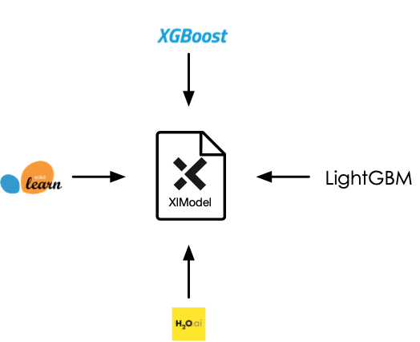

# Xelera Decision Tree Inference

**Xelera Decision Tree Inference** provides FPGA-accelerated inference (prediction) for real-time Classification and Regression applications when high-throughput or low-latency matters. It supports **Random Forest**, **XGBoost** and **LightGBM** algorithms.

1. Train your own model using one of the supported frameworks (**scikit-learn**, **XGBoost**, **LightGBM**, **H20.ai**) and convert it to a unified representation (XlModel) for Alveo Accelerator Cards

2. Integrate with your application via Python and run with an auto-scalable inference server

Additional resource:
* [Random Forest Inference Benchmark on Lenovo Thinksystem SE350](https://xelera.io/assets/downloads/Benchmarks/benchmark-001---edge-server-random-forest-inference.pdf)
* [Blog post on accelerating Decision tree-based predictive analytics](https://xelera.io/blog/acceleration-of-Decision-tree-ensembles)

## What's New on 0.4.0b4
[Release notes](docs/releaseNotes.md)
* Supported algorithms:
    * XGBoost
        * Classification (Binomial and Multinomial on selected Alveo cards)
    * LightGBM
        * Classification (Binomial and Multinomial on selected Alveo cards)
* Latency optimized inference
* Python interface with non-blocking calls
* Inference server with a single FPGA card
* License support

## Acceleration Platforms

|            Cards/Platform            |     Shell        |
| :-------------------------: |:-------------------------: |
|   [Xilinx Alveo U50](https://www.xilinx.com/products/boards-and-kits/alveo/u50.html) | xilinx_u50_gen3x16_xdma_201920_3 |  
|   [Xilinx Alveo U200](https://www.xilinx.com/products/boards-and-kits/alveo/u200.html) | xilinx-u200-xdma-201830.2 | 
|   [Nimbix](https://platform.jarvice.com) nx_u50_202010| xilinx_u50_gen3x16_xdma_201920_3 |  
|   [Nimbix](https://platform.jarvice.com) nx_u200_202010| xilinx-u200-xdma-201830.2 | 
|   [AWS f1.2xlarge](https://aws.amazon.com/de/ec2/instance-types/f1/)                     | xilinx_aws-vu9p-f1_shell-v04261818_201920_1 |

## Features and Limitations
For supported features and current limitations, see [supported parameters](docs/supportedFeatures.md).

## Usage

#### Installation

Xelera Decision Tree Inference is available:
* [On-premises](docs/on-premises.md)
* [Nimbix](docs/nimbix.md)
* [AWS](docs/aws-marketplace.md)

#### Get started with examples
* [Predict the flight delay](docs/exampleFlight.md)

## Cheat Sheet

* [Random Forest](docs/cheatSheetRF.md)
* [XGBoost](docs/cheatSheetXGBoost.md)
* [LightGBM](docs/cheatSheetLightGBM.md)

## API changes

See [API migration](docs/migration.md) for instructions to migrate to the updated API of this release.

## Contacts

In case of questions, contact [info@xelera.io](mailto:info@xelera.io)
