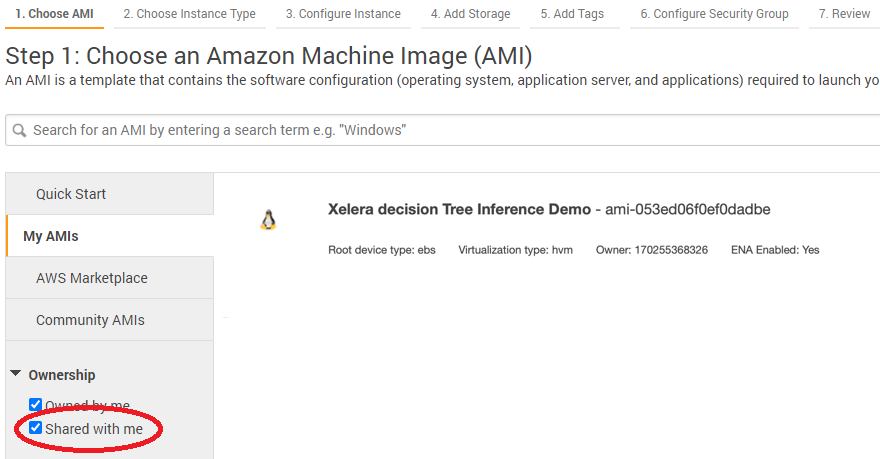

# Xelera decision Tree Inference

<p align="center">

</p>

**Xelera decision Tree Inference** provides FPGA-accelerated inference (prediction) for real-time Classification and Regression applications when high-throughput or low-latency matters. It supports **Random Forest**, **XGBoost** and **LightGBM** algorithms. The user should first train its own model using one of the supported frameworks (**scikit-learn**, **XGBoost**, **LightGBM**, **H20.ai** and **H20 Driverless AI**) and then load and run the prediction via a Python call to Xelera decision Tree Inference Library.


Additional resource:
* [Random Forest Inference Benchmark on Lenovo Thinksystem SE350](https://xelera.io/assets/downloads/Benchmarks/benchmark-001---edge-server-random-forest-inference.pdf)
* [Blog post on accelerating decision tree-based predictive analytics](https://xelera.io/blog/acceleration-of-decision-tree-ensembles)

## What's New
[Release notes](docs/releaseNotes.md)
* Supported algorithms:
    * Random Forest
        * Regression
        * Classification (Binomial and Multinomial)
    * XGBoost
        * Regression
        * Classification (Binomial)
    * LightGBM
        * Regression
        * Classification (Binomial)
* Supported frameworks:
    * scikit-learn
    * XGBboost
    * LightGBM
* Python interface
* Single model inference
* Latency optimized inference (no throughput mode)

## Acceleration Platforms

|            Cards/Platform            |     Shell        |  Note        |
| :-------------------------: |:-------------------------: |:-------------------------: |
|   [Xilinx Alveo U200](https://www.xilinx.com/products/boards-and-kits/alveo/u200.html) | xilinx-u200-xdma-201830.2 |  [Docker image](https://hub.docker.com/r/xeleratechnologies/decision-tree-inference) |
|   [AWS f1.2xlarge](https://aws.amazon.com/de/ec2/instance-types/f1/)                     | xilinx_aws-vu9p-f1_shell-v04261818_201920_1 | provided as AMI <br> [Request access](https://xelera.io/survey-aws-ami-xelera-tree-inference-engine)|

## Features and Limitations
For supported features and current limitations, see [supported parameters](docs/supportedFeatures.md).

## Usage

#### Installation

Xelera decision Tree Inference is available as:

###### AMI for AWS

0. [Request access](https://xelera.io/survey-aws-ami-xelera-tree-inference-engine) to the Xelera decision Tree Inference Demo AMI
1. Launch a new EC2 f1.2xlarge Instance using the the Xelera decision Tree Inference Demo AMI. Xelera decision Tree Inference Demo AMI is available under "My AMIs" -> "shared with me" section of the "Step 1: Choose an Amazon Machine Image (AMI)" panel.

<p align="center">

</p>

2. Connect to the remote EC2 instance. Use `centos` as username.
3. Navigate to the `xelera_demo` folder: `cd /app/xelera_demo`
4. Source the setup script: `source xelera_setup.sh`

###### Docker Image for Alveo cards

1. [Request License](https://xelera.io/survey-aws-ami-xelera-tree-inference-engine) for the Xelera decision Tree Inference Docker Image.
2. [Install Docker](https://docs.docker.com/get-docker/) and [ensure your linux user is in the docker group](https://docs.docker.com/engine/install/linux-postinstall/)
3. [Install Xilinx Runtime Library (XRT)](https://github.com/Xilinx/XRT) on the host system
4. Run the container

```
tagname="on-premise-u200-0.3.0b3"

user=`whoami`
timestamp=`date +%Y-%m-%d_%H-%M-%S`

xclmgmt_driver="$(find /dev -name xclmgmt\*)"
docker_devices=""
echo "Found xclmgmt driver(s) at ${xclmgmt_driver}"
for i in ${xclmgmt_driver} ;
do
  docker_devices+="--device=$i "
done

render_driver="$(find /dev/dri -name renderD\*)"
echo "Found render driver(s) at ${render_driver}"
for i in ${render_driver} ;
do
  docker_devices+="--device=$i "
done

docker run \
     -it \
     --rm \
     $docker_devices \
     -e "TERM=xterm-256color" \
     --name cont-decision-tree-inference-$USER-$timestamp \
     xeleratechnologies/decision-tree-inference:${tagname} \
     /bin/bash .
```

5. Using a new terminal, load the LICENSE file into the container `<license_file>.xlicpak`:
    * Get the running `<containers_id>`: `docker ps | grep "decision-tree-inference"`
    * `docker cp <license_file>.xlicpak <container_id>:/usr/share/xelera/<license_file>.xlicpak`


#### Get started with examples
* [Predict the flight delay](docs/exampleFlight.md)

## Cheat Sheet

* [Random Forest](docs/cheatSheetRF.md)
* [XGBoost](docs/cheatSheetXGBoost.md)
* [LightGBM](docs/cheatSheetLightGBM.md)

## Contacts

In case of questions, contact [info@xelera.io](mailto:info@xelera.io)
