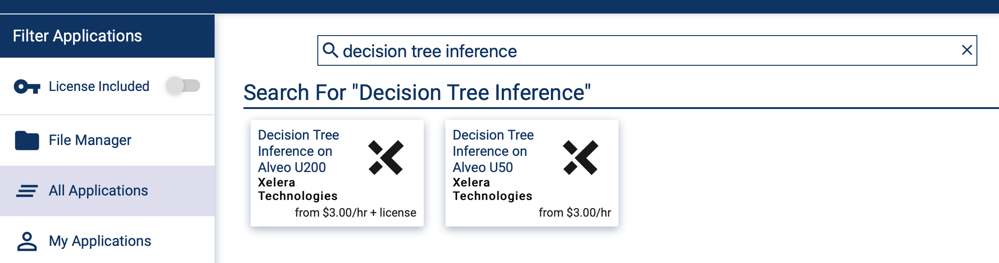
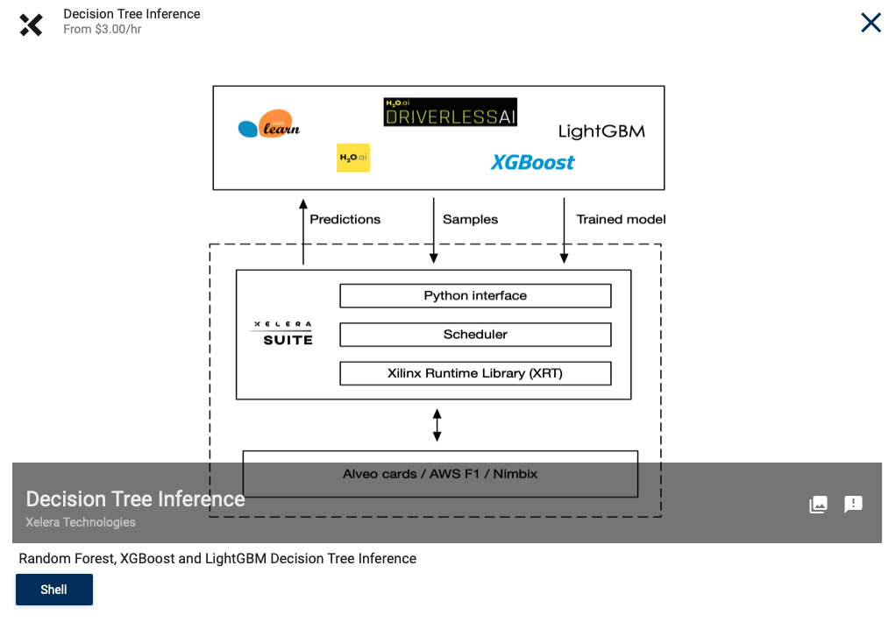
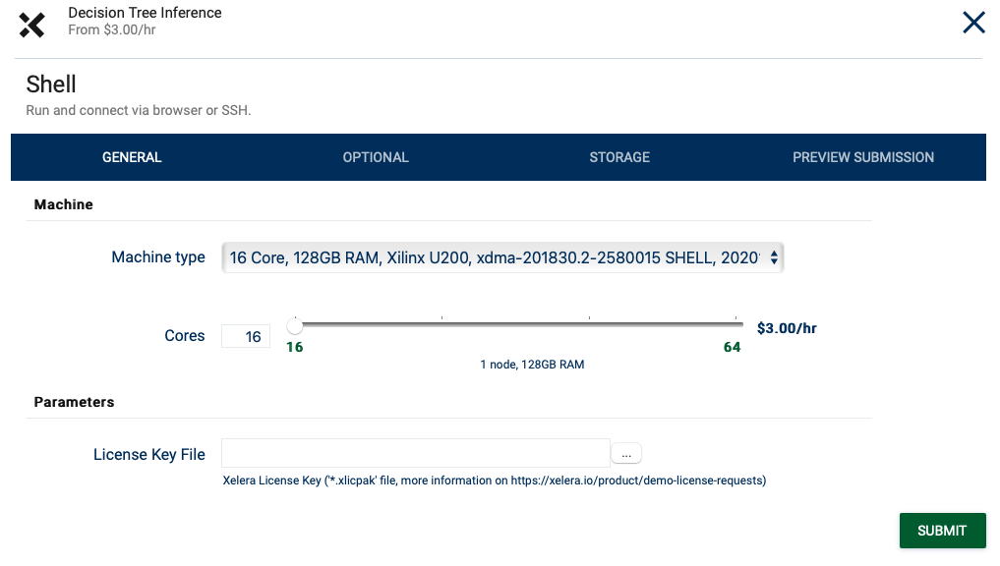

# Nimbix

1. [Request License](https://xelera.io/product/demo-license-requests) for the Xelera decision Tree Inference Docker Image and download the License Key File `<license-file>.xlicpak`
2. Sign up for Nimbix Service: https://www.nimbix.net/alveotrial
3. Application Execution
    * Search and click on **Decision Tree Inference** on the Nimbix application list
        

        
        

    * Click on **Shell** button in the lower left of the pop-up window
        

        
        

    * Run the Application by setting the **License Key File** file downloaded earlier on your computer and click on **Submit** button
        

        
        

4. 4. SSH to the launched instance: `ssh nimbix@<nimbix-instance-ip>`
